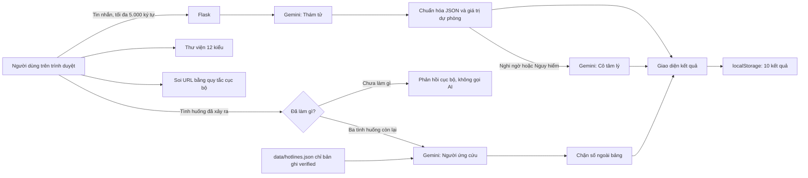

# Sơ đồ kiến trúc

```mermaid
flowchart LR
    U[Người dùng trên trình duyệt] -->|Tin nhắn, tối đa 5.000 ký tự| F[Flask]
    F --> D[Gemini: Thám tử]
    D --> N[Chuẩn hóa JSON và giá trị dự phòng]
    N -->|Nghi ngờ hoặc Nguy hiểm| P[Gemini: Cô tâm lý]
    N --> R[Giao diện kết quả]
    P --> R
    R --> L[localStorage: 10 kết quả]
    U -->|Tình huống đã xảy ra| C{Đã làm gì?}
    C -->|Chưa làm gì| S[Phản hồi cục bộ, không gọi AI]
    C -->|Ba tình huống còn lại| E[Gemini: Người ứng cứu]
    H[data/hotlines.json chỉ bản ghi verified] --> E
    E --> V[Chặn số ngoài bảng] --> R
    U --> A[Thư viện 12 kiểu]
    U --> B[Soi URL bằng quy tắc cục bộ]
```

Khóa Gemini chỉ ở biến môi trường của Flask. Trình duyệt không nhận khóa. Cô tâm lý và Người ứng cứu có khối lỗi độc lập.
